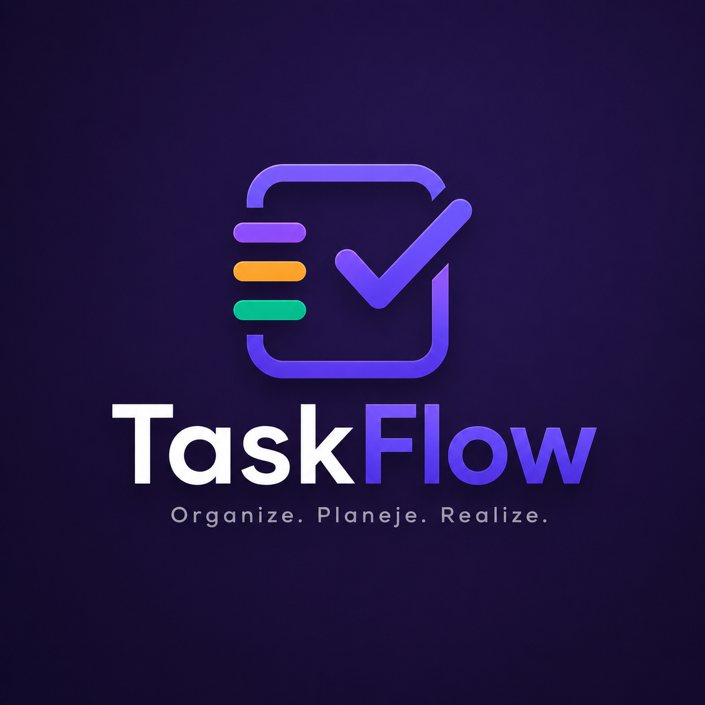

# 🚀 TaskFlow

<div align="center">



# TaskFlow

### Organize. Planeje. Realize.

Sistema profissional de gerenciamento de tarefas desenvolvido com React, TypeScript e Vite.


</div>

---

# 🎨 Preview do Sistema

<p align="center">
  
</p>

---

# 📸 Screenshots

## 🏠 Dashboard

<p align="center">
  
</p>

---

## 📝 Gerenciamento de Tarefas

<p align="center">
  
</p>

---

## 🎯 Kanban Board

<p align="center">
  
</p>

---

## 📅 Calendário

<p align="center">
  
</p>

---

## 📓 Sistema de Notas

<p align="center">
  
</p>

---

## 📊 Analytics

<p align="center">
  
</p>

---

## ⚙️ Configurações

<p align="center">
  
</p>

---

# 📋 Sobre o Projeto

O TaskFlow é uma plataforma moderna de gerenciamento de tarefas desenvolvida para profissionais, estudantes e empresas que desejam organizar suas atividades de forma eficiente.

O sistema oferece uma experiência completa com:

* Dashboard analítico
* Kanban Board
* Calendário inteligente
* Sistema de notas
* Dark Mode
* Armazenamento local
* Relatórios e métricas
* Interface responsiva

Tudo isso em uma experiência visual moderna utilizando Glassmorphism e animações fluidas.

---

# ✨ Principais Recursos

## 📝 Gerenciamento de Tarefas

* Criar tarefas
* Editar tarefas
* Excluir tarefas
* Duplicar tarefas
* Busca em tempo real
* Filtros avançados
* Organização por categorias
* Controle por prioridades

### Prioridades

* 🟢 Baixa
* 🔵 Média
* 🟠 Alta
* 🔴 Urgente

### Status

* 📌 Pendente
* ⚙️ Em andamento
* ✅ Concluído
* ❌ Cancelado

---

## 📊 Dashboard Analytics

* Total de tarefas
* Taxa de conclusão
* Tarefas pendentes
* Tarefas atrasadas
* Produtividade diária
* Produtividade semanal
* Produtividade mensal

### Gráficos

* Pizza
* Barras
* Linha

---

## 🎯 Kanban Board

Sistema completo de Drag & Drop.

### Colunas

* Pendente
* Em andamento
* Concluído

### Recursos

* Arrastar e soltar
* Atualização automática
* Contadores por coluna
* Feedback visual animado

---

## 📅 Calendário Inteligente

* Visualização mensal
* Navegação entre meses
* Tarefas por dia
* Destaque da data atual
* Organização de compromissos

---

## 📓 Sistema de Notes

* Markdown completo
* Preview em tempo real
* Tags personalizadas
* Favoritos
* Cores personalizadas
* Upload de imagens
* Upload de PDFs
* Busca avançada
* Importação e exportação

---

## ✅ Tarefas Concluídas

* Estatísticas completas
* Restaurar tarefas
* Exportar CSV
* Exclusão em massa
* Filtros por período

---

## ⚙️ Configurações

* Dark Mode
* Light Mode
* Auto Save
* Controle de notificações
* Limpeza de dados

---

# 🛠️ Tecnologias Utilizadas

| Tecnologia      | Função           |
| --------------- | ---------------- |
| React           | Interface        |
| TypeScript      | Tipagem          |
| Vite            | Build Tool       |
| Framer Motion   | Animações        |
| Recharts        | Gráficos         |
| React Icons     | Ícones           |
| Date-fns        | Datas            |
| React Markdown  | Markdown         |
| React Hot Toast | Notificações     |
| React Color     | Seletor de cores |
| DnD Kit         | Drag & Drop      |

---

# 📁 Estrutura do Projeto

```bash
taskflow/
│
├── public/
│   ├── logotask.png
│   │
│   └── screenshots/
│       ├── dashboard.png
│       ├── tasks.png
│       ├── kanban.png
│       ├── calendar.png
│       ├── notes.png
│       ├── analytics.png
│       └── settings.png
│
├── src/
│   ├── components/
│   ├── contexts/
│   ├── hooks/
│   ├── pages/
│   ├── services/
│   ├── styles/
│   ├── types/
│   ├── App.tsx
│   └── main.tsx
│
├── package.json
├── vite.config.ts
├── tsconfig.json
└── README.md
```

---

# 🚀 Instalação

## Clone o Projeto

```bash
git clone https://github.com/seu-usuario/taskflow.git

cd taskflow
```

## Instale as Dependências

```bash
npm install
```

## Execute o Projeto

```bash
npm run dev
```

## Acesse

```bash
http://localhost:5173
```

---

# 📦 Scripts Disponíveis

```bash
npm run dev
```

Inicia o ambiente de desenvolvimento.

```bash
npm run build
```

Gera a build de produção.

```bash
npm run preview
```

Visualiza a build localmente.

```bash
npm run lint
```

Executa verificações de código.

---

# 🎨 Design System

## Paleta Principal

```css
:root {
  --primary: #4F46E5;
  --secondary: #7C3AED;
  --accent: #8B5CF6;

  --success: #10B981;
  --danger: #EF4444;
  --warning: #F59E0B;
  --info: #3B82F6;
}
```

---

# 🌙 Temas

## Dark Mode

```css
background: #0F0F1A;
color: #FFFFFF;
```

## Light Mode

```css
background: #F9FAFB;
color: #111827;
```

---

# 🚧 Roadmap

* 🔔 Notificações Push
* ☁️ Sincronização em Nuvem
* 👥 Compartilhamento de Tarefas
* 📱 Aplicativo Mobile
* 🌐 API Própria
* 🔐 Sistema de Login
* 👨‍👩‍👧‍👦 Multiusuário

---

# 🎯 Casos de Uso

## Profissionais

* Gestão de Projetos
* Controle de Demandas
* Organização de Equipes

## Estudantes

* Planejamento de Estudos
* Controle de Trabalhos
* Organização Acadêmica

## Empresas

* Gestão Operacional
* Controle de Equipes
* Relatórios Gerenciais

---

# 🤝 Contribuição

1. Faça um Fork

2. Crie uma Branch

```bash
git checkout -b feature/nova-feature
```

3. Faça suas alterações

4. Commit

```bash
git commit -m "feat: nova funcionalidade"
```

5. Push

```bash
git push origin feature/nova-feature
```

6. Abra um Pull Request

---

# 📄 Licença

Este projeto está licenciado sob a Licença MIT.

---

# 👨‍💻 Autor

## Kauã Ferreira

Desenvolvedor Front-End e Web Developer.

### Contatos

📧 [kauafesilva05@gmail.com](mailto:kauafesilva05@gmail.com)

🐙 GitHub: https://github.com/SEU-USUARIO

💼 LinkedIn: https://linkedin.com/in/kkaua05

---

# 🙏 Agradecimentos

* React
* TypeScript
* Vite
* Framer Motion
* Recharts
* DnD Kit
* React Icons

---

<div align="center">

## ⭐ Se este projeto te ajudou, deixe uma estrela!

Desenvolvido com 💜 por **Kauã Ferreira**

</div>
